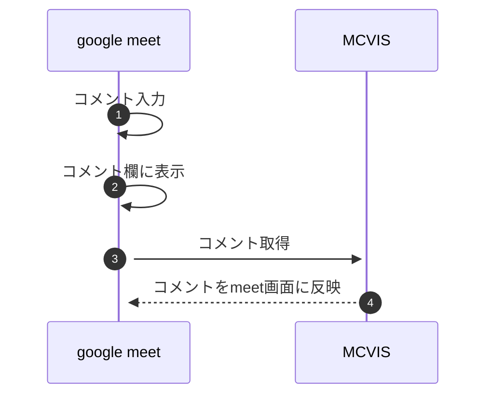

# Meet-Comment-VIS

## 実行方法
- git clone
- npm i
- npm run build

## シーケンス図

```mermaid
sequenceDiagram
  autonumber
  google meet->>+google meet: コメント入力
  google meet->>+google meet: コメント欄に表示
  google meet->>+MCVIS: コメント取得
  MCVIS-->>+google meet: コメントをmeet画面に反映
```
